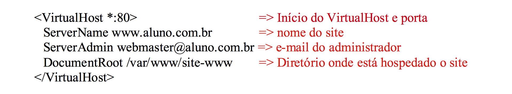
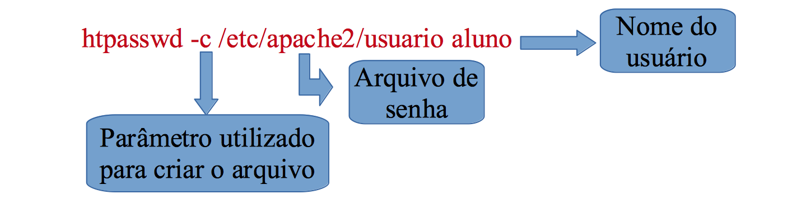
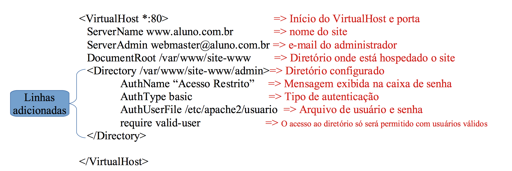
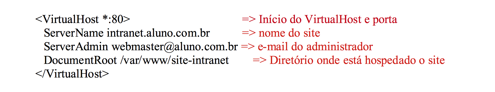

# MANUAL DE CONFIGURAÇÃO APACHE #

<h2 align="middle">INSTALAÇÃO E CONFIGURAÇÃO</h2>

O  servidor web Apache é responsável por hospedar sites para uma rede, uma de suas principais vantagens é a grande quantidade de módulos disponíveis para diversos serviços como hospedagem de scripts cgi, páginas em php, páginas com criptografia,  dentre  outros.

Para instalação do apache versão 2, utilizaremos o comando:
<h4 align="middle">apt-get install apache2</h2>

Verifique se tudo foi instalado corretamente digitando no seu navegador http://127.0.0.1, se tudo ocorreu bem aparecerá uma mensagem Its Work, caso você queira hospedar páginas com suporte a php, você deveria acrescentar o nome php5 logo após o apache2 conforme comando abaixo:

<h4 align="middle">apt-get install apache2 php5</h2>

O servidor Apache não possui pré-requisito para seu funcionamento, mas caso o administrador necessite que os usuários de sua rede acessem o site hospedado pelo nome, o servidor DNS deve está configurado para resolução destes nomes.

Neste nosso configuração iremos realizar a hospedagem de dois sites <b>http://www.aluno.com.br</b> e <b>http://intranet.aluno.com.br</b>, sendo que o site www.aluno.com.br possuirá um diretório com autenticação quando o usuário acessar o endereço http://www.aluno.com.br/admin o site só será liberado mediante usuário e senha, para essa configuração utilizaremos a nossa zona aluno.com.br, já feita em aulas anteriores, só relembrando que no arquivo db.aluno.com.br, deverá existir o nomes www e intranet apontando para a máquina que é o servidor web, que nosso caso será o ns01, conforme linhas abaixo:

<h2 align="middle">Configuração do VirtualHost para hospedar http://www.aluno.com.br</h2>

Inicialmente iremos disponibilizar uma página para testes no diretório que será hospedado a página, quando instalamos o apache por default já é criado um diretório para hospedagem /var/www/html, dentro deste diretório existe uma página de testes, iremos aproveitá-la, para criar nosso site, criaremos um diretório para colocar os arquivos do site, para isso execute o comando abaixo:

<h4 align="middle">mkdir /var/www/html/site-www</h4>

Realize uma cópia do index.html existente, e altere conforme sua necessidade, para que você possa identificar o site de testes, conforme comando abaixo:

<h4 align="middle">cp /var/www/html/index.html /var/www/html/site-www</h4>

Altere as permissões para que o dono deste diretório seja o apache, caso o site necessite realizar algum upload, ou alteração do arquivo, seja possível esse procedimento, utilize os comandos abaixo:

<h4 align="middle">chown -R www-data.www-data /var/www/html/site-www</h4>

Até o momento não estamos realizando nenhuma configuração do apache, somente disponibilizando o site para hospedagem, agora iremos criar o nosso arquivo de configuração do VirtualHost, é neste que será informado o diretório onde está localizado o site, o nome do site, porta, dentre outros. O arquivo do VirtualHost é criado no diretório /etc/apache2/sites-available, apara isso utilize o editor de texto de sua preferência criando um arquivo www no diretório citado, conforme comandos abaixo:

<h4 align="middle">cd /etc/apache2/sites-available</h4>
<h4 align="middle">nano www.conf</h4>

Adicione as linhas descritas abaixo no arquivo www.conf:

Para ativar o site digite o comando abaixo, o mesmo irá criar um link simbólico no diretório /etc/apache2/sites-enabled apontado para o arquivo www.conf no diretório /etc/apache2/sites-available:

<h4 align="middle">a2ensite www.conf</h4>

E reinicie o serviço:
<h4 align="middle">/etc/init.d/apache2 restart</h4>

<h2 align="middle">Configuração do Diretório no site www.aluno.com.br</h2>

Para criar um diretório no VirtualHost primeiramente iremos criar esta pasta no sistema com o comando abaixo:

<h4 align="middle">mkdir /var/www/html/site-www/admin</h4>

Faça uma cópia do index.html para realizar o teste e altere o site, para você identificar quando realizar os testes:

<h4 align="middle">cp /var/www/html/site-www/index.html /var/www/html/site-www/admin</h4>

Crie um arquivo de senha com usuário com o comando abaixo:

Abra o arquivo do VirtualHost no diretório /etc/apache2/sites-available/www, e acrescente as linhas conforme descrição abaixo:

<h2 align="middle">Configuração do VirtualHost para hospedar http://intranet.aluno.com.br</h2>

Disponibilize uma página para testes no diretório que será hospedado a página, quando instalamos o apache por default já é criado um diretório para hospedagem /var/www, dentro deste diretório existe uma página de testes, iremos aproveitá-la, para criar nosso site, criaremos um diretório para colocar os arquivos do site, para isso execute o comando abaixo:

<h4 align="middle">mkdir /var/www/html/site-intranet</h4>

Realize uma cópia do index.html existe, e altere conforme sua necessidade, para que você possa identificar o site de testes, conforme comando abaixo:

<h4 align="middle">cp /var/www/html/index.html /var/www/html/site-intranet</h4>

Altere as permissões para que o dono deste diretório seja o apache, caso o site necessite realizar algum upload, ou alteração do arquivo, seja possível esse procedimento, utilize os comandos abaixo:

<h4 align="middle">chown -R www-data.www-data /var/www/html/site-intranet</h4>

Crie o arquivo do VirtualHost no diretório <b>/etc/apache2/sites-available</b>, para isso utilize o editor de texto de sua preferência, conforme comandos abaixo:

<h4 align="middle">cd /etc/apache2/sites-available</h4>
<h4 align="middle">nano intranet.conf</h4>

Adicione as linhas descritas abaixo no arquivo intranet:

Para ativar o site digite o comando: <b>a2ensite intranet.conf</b>

Reinicie o serviço apache: <b>/etc/init.d/apache2 restart</b>

