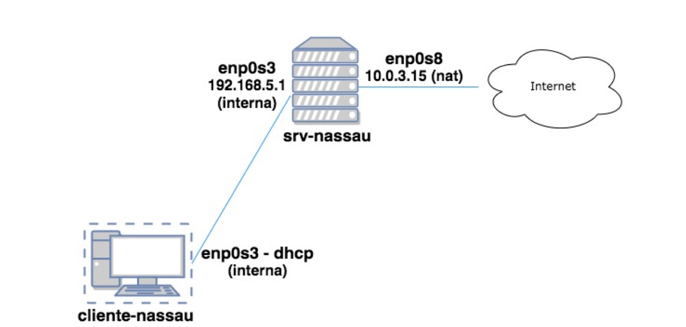
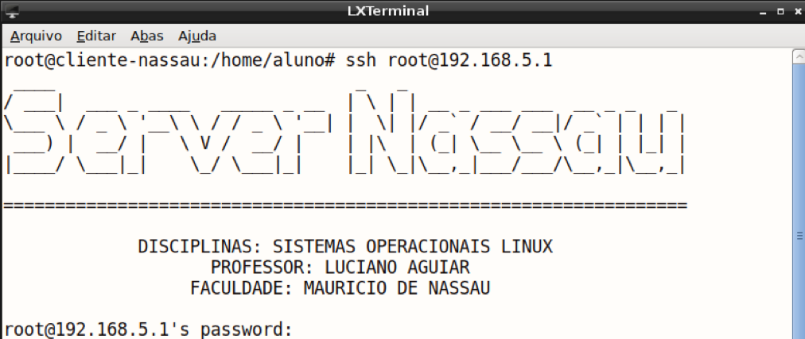

# Appliance
Para que o aluno possa configurar o ambiente proposto no presente documento o mesmo deve possuir um computador com no mínimo Processador <b>Quadcore</b> e Memória RAM de <b>3 Giga</b>.
Realizar o download do aplicativo VirtualBox no endereço descrito abaixo, conforme seu sistema operacional (A versão utilizada para criar o Appliance foi a 5.1.30):

 <a href = https://www.virtualbox.org/wiki/Downloads> VirtualBox</a>

Baixar o arquivo do Appliance no endereço descrito a seguir (Appliance é um arquivo que vem empacotado máquinas virtuais prontas para uso, em nosso laboratório existem duas, o srv-nassau e o cliente-nassau):
<a href = https://drive.google.com/file/d/1C3kqXup-NJL-1whBl_AF5JKpLljcKcjo/view?usp=sharing> Download Appliance </a>

Após concluir o download do Appliance, execute o arquivo e será aberto uma janela do VirtualBox, aceite as opções defaults e aguarde a conclusão da importação das duas máquinas virtuais para seu ambiente.

## DIAGRAMA DE REDE

Todo o ambiente prático realizado em sala de aula será baseado no ambiente virtual criado pelo VirtualBox, onde é utilizado o sistema operacional <b>Debian 9.3.0</b> em ambas as máquinas virtuais, conforme diagrama descrito na figura 1.
O Firewall denominado <b>srv-nassau</b> já possui os seguintes serviços instalados sem configuração:

 * DNS – Bind;
 * Servidor Web – Apache;
 * Proxy Squid, Sarg;
 * Servidor de E-mail – Postfix;
 * Servidor DHCP.

Com o objetivo de deixar o host <b>cliente-nassau</b> acessando a internet foi criado um pequeno script no srv-nassau para compartilhamento da conexão da interface enp0s8, localizado no diretório /etc/init.d chamado fw_nassau, conforme descrito abaixo:

<h4 align="middle">Figura 1 - Diagrama de Rede</h4>

## ADMINISTRAÇÃO DOS SISTEMAS

O firewall da rede <B>srv-nassau</B> não possui ambiente gráfico instalado e já vem com dois usuários previamente criados o <b>root</b> (administrador do sistema) e o usuário <b>aluno</b>, ambos possuem a senha <b>123456</b>, o firewall pode ser acessado via ssh a partir do <b>cliente-nassau</b> pelo comando ssh root@192.168.5.1 (usando a senha 123456), conforme podemos observar na figura 2:

<h4 align="middle">Figura 2</h4>

O host <b>cliente-nassau</b> vem configurado com um ambiente gráfico mais leve chamado LXDE, o mesmo está configurado para receber ip automaticamente do firewall, o usuário para autenticação no ambiente gráfico é <b>aluno</b> e senha <b>123456</b>, a senha do usuário root também é <b>123456</b>.
É importante pontuar que para o cliente-nassau navegar na internet se faz necessário que o srv-nassau seja inicializado previamente.

