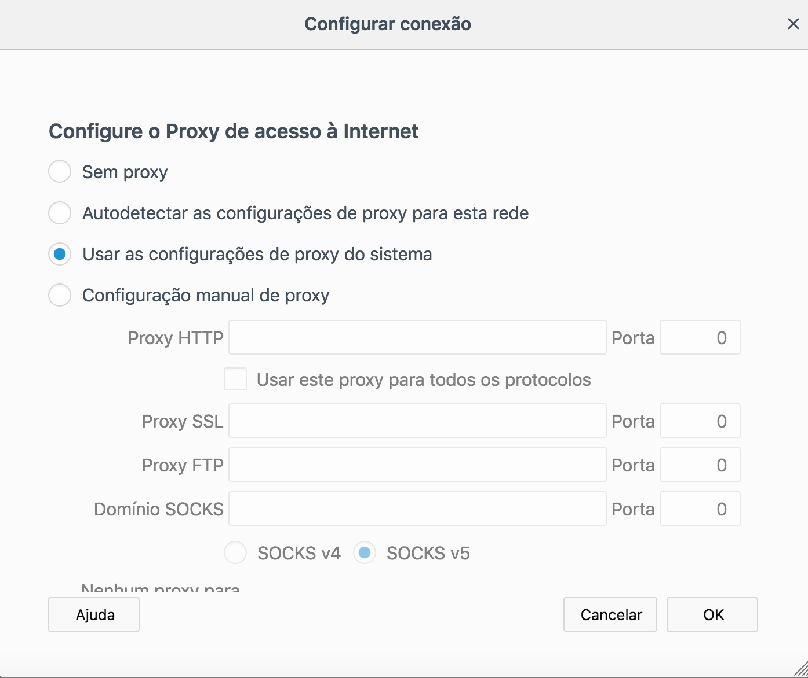

# PROXY SQUID #

<h2 align="left">INTRODUÇÃO</h2>

O Squid é um serviço Proxy e cache que permite controlar o acesso dos usuários a páginas indevidas, bem como melhorar a velocidade de acesso através do cache, é uma aplicação multiplataforma podendo ser instalado no Windows rodando como serviço. O Squid suporta os protocolos HTTP, HTTPS, FTP, entre outros, encontra-se atualmente na versão 3.5, podemos encontrar o código fonte no site: http://www.squid-cache.org

<h2 align="left">CARACTERÍSTICAS</h2>

O serviço Squid proporciona uma série de funcionalidades que auxiliam o administrador de rede na gestão do ambiente e ainda, características que auxiliam no controle de banda e aumento da velocidade no acesso dos usuários, considerando implementações de cache estáticas. Segue abaixo caracterização de suas principais funcionalidades:

<b>Cache</b> - o Squid armazena em cache o conteúdo acessado, baseado nos limites de tamanho do objeto, de maneira que se algum outro host fizer acesso ao mesmo conteúdo, a requisição será disponibilidade a partir do arquivo em cache salvo previamente. É importante pontuar que o Squid suporta somente cache de conteúdo estáticos, todavia a configuração de cache estática reduz o consumo de banda, considerando que o segundo acesso ao dado estático é feito a partir da cache.

<b>Autenticação</b> – Pode-se controlar o acesso a internet a partir da implementação de autenticação, onde somente os usuários previamente cadastrados terão acesso liberado. O Squid suporta diversos tipos de autenticação, entre elas samba, Active Directory, LDAP e um esquema de autenticação básica.

<b>Registro de acessos</b> – Todos os acessos dos usuários da rede são registrados em arquivos de log (/var/log/access.log), podendo esses serem utilizados para as mais diversas finalidades, que vão desde a análise de performance do servidor, até a geração de relatórios detalhados dos acessos à internet. O access.log é um arquivo de texto, tornando sua análise difícil, todavia existe um aplicativo chamado Sarg que transforma este arquivo em páginas html disponibilizando um relatório detalhado dos usuários.

<b>Controle centralizado</b> - com o uso do Squid temos a facilidade de um único ponto centralizador do acesso à internet, e através destas características controlar o acesso dos usuários baseados nos mais diversos requisitos como: tipo de arquivo, tamanho, velocidade de acesso, horário, usuário, protocolo, entre outros.

<h2 align="left">PROXY TRANSPARENTE</h2>

Cada estação de trabalho para acessar a internet através de um proxy Squid necessita realizar a configuração prévia em seus navegadores informando o endereçamento ip e porta do servidor proxy, conforme observado na <b>Fig. 1</b>: 

Uma das maneiras mais eficientes de implementação de um proxy, levando-se em consideração a necessidade de controle, é com uso da técnica denominada proxy transparente. Isto é feito com a utilização de uma regra no firewall que efetua o redirecionamento das requisições destinadas à internet ao servidor proxy. Esse redirecionamento faz com que não mais precisem ser configurados os softwares com as informações do proxy, pois o firewall se encarrega de redirecionar as requisições a redes externas para o Squid.

Para implementarmos esse redirecionamento precisamos apenas inserir no Iptables, que é o software para criação de firewall no Linux, a seguinte regra:

<h5 align="middle">iptables -t nat -A PREROUTING -i eth0 -p tcp --dport 80 -j REDIRECT --to-port 3128</h5>

Estas regras dizem ao firewall que todas a requisições que entrarem pela interface eth0 (interface usada neste caso apenas como exemplo), no nosso caso esta é a interface onde está ligada nossa rede interna, destinadas a porta 80, que é a porta padrão do serviço WWW, e que o protocolo seja o TCP, devem ser redirecionadas para a porta 3128, que é o servidor proxy.

Vale ressaltar que este recurso de proxy transparente não funciona com a autenticação de usuário, portanto cabe uma análise de qual dos dois será mais interessante para cada caso, já que deveremos fazer uma escolha entre eles.

Uma implementação que pode substituir a necessidade de configuração de proxy transparente é a utilização de GPO no Active Directory, no qual a GP realiza a configuração do proxy no navegador na autenticação do usuário na rede.

<h2 align="left">AUTENTICAÇÃO NO SQUID</h2>

A configuração padrão do Squid proporciona o controle de acesso por máquina, todavia o Squid fornece mecanismos efetuarmos um controle por usuário, desta forma cada usuário que deseje ter acesso à internet deverá antes de tudo se autenticar no proxy, para que seu acesso seja liberado.
A autenticação poderá ser feita de várias maneiras, como por exemplo, no formato NCSA (geralmente associado ao utilitário htpasswd, o mesmo utilizado pelo Apache), ou ainda através de um servidor LDAP, um PDC Windows NT/2000, ou módulos PAM, etc. A maneira mais comum de realizar autenticação é com o uso do formato NCSA que usa o módulo ncsa_auth. Para este trabalho nossa implementação foi baseada neste método.

O cadastro dos usuários para acesso ao Squid é feito com o uso do utilitário htpasswd, conforme podemos ver no exemplo abaixo, lembrando apenas que a opção -c deve ser usada apenas caso o arquivo de senhas ainda não exista, pois ela instrui o utilitário a criá-lo.

<h5 align="middle">htpasswd -c arquivo_de_senhas usuario</h5>

Para que o Squid forneça suporte a autenticação devemos habilitar estas configurações no arquivo squid.conf através da TAG auth_param. É nela que são realizadas as mudanças necessárias para que o esquema de autenticação comece a funcionar, já que por padrão ele não vem habilitado. No próprio arquivo tem comentários que mostram como isso deve ser feito para cada tipo escolhido. Como vamos utilizar o método básico, nossa configuração ficou assim.

<h5 align="left">auth_param basic program /usr/lib/squid/basic_ncsa_auth /etc/squid/squid-passwd 

auth_param basic children 5 

auth_param basic realm Servidor Proxy Squid ARL auth_param basic credentialsttl 2 hours</h5>

A linha <b>auth_param basic program /usr/lib/squid/basic_ncsa_auth /etc/squid/Squid_passwd</b> especifica qual módulo será usado, no caso /usr/lib/squid/basic_ncsa_auth é onde se encontra o arquivo com os usuários e senhas gerado conforme comentado acima. Em <b>auth_param basic children 5</b> estamos definindo quantos processos filhos do módulo de autenticação poderão existir, esse número é o padrão do Squid, entretanto em redes maiores pode haver a necessidade de um incremento deste, devido ao número provavelmente maior de usuários que precisarão se autenticar simultaneamente. Em auth_param basic realm Servidor Proxy Squid ARL configura-se a mensagem que aparecerá na tela onde são fornecidas as informações do usuário para autenticação. Esta opção é interessante para que possamos personalizar este mensagem da tela de login do nosso servidor. E por último auth_param basic credentialsttl 2 hours especifica a validade de uma autenticação bem-sucedida.

Com estas configurações já temos nosso proxy habilitado a trabalhar com autenticação de usuários, bastando para isso que sejam feitas ACL's para isso e definidas as regras de acesso.

<h2 align="left">Principais TAG's do arquivo squid.conf</h2>

Toda a configuração do Squid é realizado no arquivo squid.conf localizado no diretório /etc/squid, seus parâmetros são classificados como TAG, segue abaixo descrição das principais:

 * <b>cache_mem</b> - define a quantidade de memória RAM que o Squid irá usar;
 * <b>cache_dir</b> - determina onde e como será feito o cache do conteúdo estático;
 * <b>visible_hostname</b> - exibe o nome do servidor proxy nas mensagens de erro, caso contrário o Squid vai tentar descobrir o nome através do DNS.
 * <b>error_directory</b> - com o uso desta opção podemos determinar em qual linguagem serão apresentadas as mensagens de erro. Seu uso é recomendado, pois por padrão as mensagens são em inglês. Em /usr/share/squid-langpack/ existem vários subdiretórios com as linguagens suportadas pelo Squid. E estas mensagens, inclusive, podem ser facilmente personalizadas, pois estão em arquivos no formato html.

Ainda existem várias outras TAGs, todavia podem ser visualizadas no arquivo squid.conf, onde já existe uma explicação sobre cada uma delas.

 
<h2 align="left">Lista de Controle de Acesso - ACL</h2>

As Listas de Controle de Acesso definem uma regra para as estações de trabalho que estão acessando a rede pelo proxy Squid.

A sinopse do seu emprego é descrita a seguir:

<h5 align="middle">acl nomeacl tipo_acl parametro</h5>

<h3 align="left">Tipos de ACL</h3>
 

<b>src</b> - utilizado para indicar endereços IP de origem, faixa de ip ou rede. Pode-se especificar um endereço de rede, como 192.168.16.0/24, um endereço de um determinado host, como 192.168.16.10/24 ou uma faixa de endereços, como 192.168.16.10-192.168.16.20/24;

 <b>dst</b> – utilizado para indicar endereços de destino.

<b>srcdomain</b> - indicado para verificar o domínio da máquina cliente.

<b>dstdomain</b> - usado para indicar domínio de destino.

<b>srcdom_regex</b> – usado para especificar expressões regulares de origem.

<b>dstdom_regex</b> - usado para especificar expressões regulares de domínio de destino.

<b>time</b> - usado para especificar dias da semana e horários. Os dias da semana são definidos através de letras que os representam, e os horários através de intervalos na forma hora:minuto_inicio- hora:minuto_final. Os dias da semana são especificados assim: S - Sunday (Domingo), M - Monday (Segunda-Feira), T - Tuesday (Terça-Feira), W - Wednesday (Quarta-Feira), H - Thursday (Quinta- Feira), F - Friday (Sexta-Feira) e A - Saturday (Sábado).

<b>url_regex</b> - Este tipo de ACL percorre a URL a procura da expressão regular especificada. Deve ser observado que a expressão é case-sensitive, para que seja case-insensitive deve ser usada a opção -i. É o tipo mais comum de ACL dada a flexibilidade proporcionada pelo uso de expressões regulares.

<b>port</b> – utilizada para especificar a porta de um serviço.

<b>proxy_auth</b> – tipo de ACL usada para implementar autenticação de usuários no proxy. A autenticação é feita com uso de softwares externos. Podem ser passados os nomes dos usuários ou usada a opção REQUIRED para que seja autenticado qualquer usuário válido.

<h2 align="left">Construindo Regras de Acesso</h2>

As regras de liberação e bloqueio são feitas a partir da TAG http_access, é importante pontuar que a leitura das regras é feita pelo proxy, de cima para baixo e executada, não realizado a execução de uma regra e lendo a seguinte.

Apresentamos abaixo alguns exemplos de como construir regras de acesso:

1. Controlando acesso pela rede de origem:

acl minharede src 192.168.16.0/24 

http_access allow minharede 

2. 	Controlando o acesso pela rede destino:

acl outra_rede dst 192.168.17.0/24

http_access allow outra_rede 

3. Controlando acesso pelo nome de domínio de origem e destino:

acl dominio-interno srcdomain .meudominio.com.br 

acl dominio-externo .lafora.com.br 

http_access allow dominio-interno dominio-externo

4. Controlando o acesso usando autenticação de usuário: 

acl usuarios proxy_auth REQUIRED

http_access allow usuarios 

5. Controlando acesso por exceção:

acl usuarioliberado proxy_auth aluno

acl bloqueados url_regex -i bate-papo

http_access deny bloqueados !usuarioliberado
